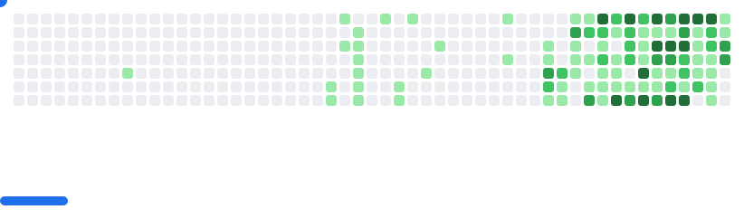

### My name is `William Mendes`, welcome to my `readme.md`!

<h2 align="center"> 👾 Data Analyst | Full Stack Dev 👾 </h2>

 
  

## 𒆙 About Me /

> **The city is broken.** _We are the code that fixes it..._

<h3>I’m an evolving professional, blending Full Stack Development with Data Analysis to build high-impact solutions. Currently pursuing a degree in Analysis and Systems Development (ADS), I follow a strategic growth plan to solidify my career in tech.</h3>

 

<h2>𒆙 Tech Stack</h2>

<strong>𒆙 Full Stack Developer</strong>

  

    <strong>▪︎ Frontend:</strong> 
    
  

  

    <strong>▪︎ Backend & Databases:</strong> 
    
  

  

    <strong>▪︎ DevOps & Ferramentas:</strong> 
    
  

   

<strong> 𒆙 Data Analyst</strong>

  

    <strong>▪︎ Languages ​​and Libraries:</strong> 
    
  

  

    <strong>▪︎ Databases and Cloud:</strong> 
    
  

## 𒆙 My Stats

| Statistics                                                                                       | Repositories by Language                                                                                      |
| ------------------------------------------------------------------------------------------------ | ------------------------------------------------------------------------------------------------------------- |
|  |  |

| Productive Hours                                                                                                       | Most Used Language                                                                                              |
| ---------------------------------------------------------------------------------------------------------------------- | --------------------------------------------------------------------------------------------------------------- |
|  |  |

  
<strong>Let's connect and build something amazing together!</strong>

<picture>
  <source
    media="(prefers-color-scheme: dark)"
    srcset="images/breakout-dark.svg"
  />
  <source
    media="(prefers-color-scheme: light)"
    srcset="images/breakout-light.svg"
  />
  
</picture>

